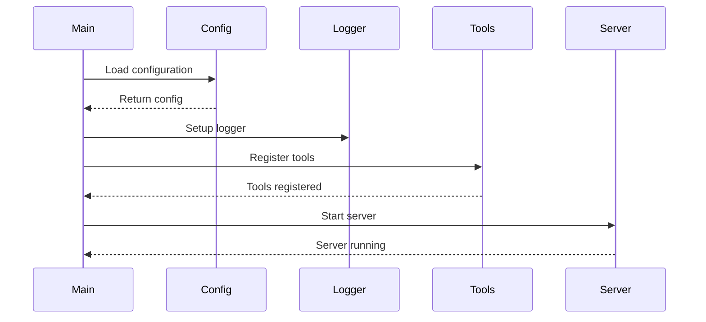
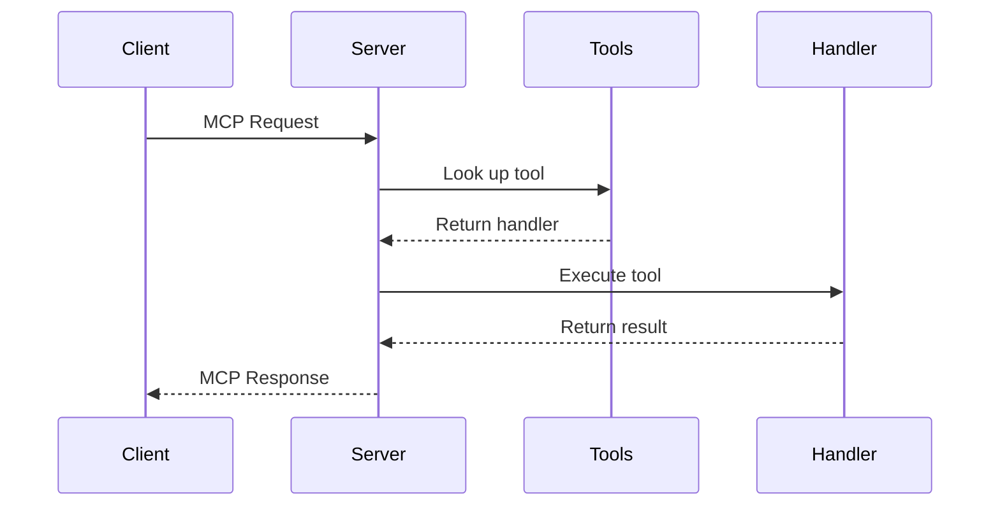

# 架构设计

本文档描述 Dizi MCP 服务器的整体架构设计和实现原理。

## 系统概览

Dizi 是一个基于 Model Context Protocol (MCP) 的服务器实现，采用模块化设计，支持多种传输方式和工具类型。

```
┌─────────────────────────────────────────────────────────────┐
│                        Client                               │
│                  (Claude Desktop, etc.)                    │
└─────────────────────┬───────────────────────────────────────┘
                      │ MCP Protocol
                      │ (stdio/SSE)
┌─────────────────────▼───────────────────────────────────────┐
│                   Dizi Server                              │
│  ┌─────────────┐ ┌─────────────┐ ┌─────────────────────┐   │
│  │   Config    │ │   Logger    │ │      Server         │   │
│  │  Management │ │  Management │ │   (stdio/SSE)       │   │
│  └─────────────┘ └─────────────┘ └─────────────────────┘   │
│  ┌─────────────────────────────────────────────────────┐   │
│  │                Tool Registry                        │   │
│  │  ┌─────────┐ ┌─────────┐ ┌─────────────────────┐   │   │
│  │  │ Builtin │ │ Command │ │    Filesystem       │   │   │
│  │  │  Tools  │ │  Tools  │ │      Tools          │   │   │
│  │  └─────────┘ └─────────┘ └─────────────────────┘   │   │
│  └─────────────────────────────────────────────────────┘   │
└─────────────────────────────────────────────────────────────┘
```

## 核心组件

### 1. 配置管理 (Config)

**位置：** `internal/config/`

**职责：**
- 加载和解析 YAML 配置文件
- 提供默认配置
- 配置验证

**关键特性：**
- 支持配置文件不存在时的默认配置
- YAML 格式，易于阅读和编辑
- 结构化配置验证

```go
type Config struct {
    Name        string       `yaml:"name"`
    Version     string       `yaml:"version"`
    Description string       `yaml:"description"`
    Server      ServerConfig `yaml:"server"`
    Tools       []ToolConfig `yaml:"tools"`
}
```

### 2. 日志管理 (Logger)

**位置：** `internal/logger/`

**职责：**
- 智能日志输出管理
- 根据传输方式自动调整日志行为
- 避免干扰 MCP 协议通信

**关键特性：**
- stdio 模式下自动静音，避免干扰协议
- SSE 模式下正常输出，便于调试
- 线程安全的日志记录

### 3. 服务器 (Server)

**位置：** `internal/server/`

**职责：**
- SSE 传输的自定义实现
- 查询参数处理
- 动态工具启用

**关键特性：**
- 支持查询参数动态启用文件系统工具
- 每个请求独立的 MCP 服务器实例
- 安全的工具隔离

### 4. 工具系统 (Tools)

**位置：** `internal/tools/`

**职责：**
- 工具注册和管理
- 多种工具类型支持
- 参数验证和占位符替换

#### 4.1 工具类型

**Builtin 工具：**
- Go 代码直接实现
- 高性能，低延迟
- 内置安全验证

**Command 工具：**
- 执行系统命令
- 支持参数占位符
- 命令行参数灵活配置

**Script 工具：**
- 执行 shell 脚本
- 支持多行脚本
- 环境变量和参数支持

**Filesystem 工具：**
- 完整的文件系统操作
- 安全的路径验证
- 细粒度权限控制

## 数据流

### 1. 启动流程



### 2. 请求处理流程



## 设计原则

### 1. 模块化

每个组件都有明确的职责边界：
- **Config**: 只负责配置管理
- **Logger**: 只负责日志输出
- **Server**: 只负责协议处理
- **Tools**: 只负责工具执行

### 2. 安全第一

所有外部输入都经过严格验证：
- 参数类型检查
- 路径安全验证
- 命令注入防护
- 权限最小化

### 3. 高性能

设计考虑性能优化：
- 零拷贝字符串处理
- 最小化内存分配
- 并发安全设计
- 懒加载机制

### 4. 易于扩展

支持多种扩展方式：
- 新工具类型注册
- 自定义传输方式
- 插件化架构

## 关键技术决策

### 1. Go 语言选择

**优势：**
- 高性能编译型语言
- 优秀的并发支持
- 丰富的标准库
- 交叉编译支持

### 2. 嵌入式配置

使用 `go:embed` 嵌入示例配置：
- 简化部署流程
- 确保配置模板可用
- 减少外部依赖

### 3. 接口设计

使用接口而非具体类型：
```go
type ToolHandler func(context.Context, mcp.CallToolRequest) (*mcp.CallToolResult, error)
```

**好处：**
- 易于测试
- 支持多种实现
- 降低耦合度

### 4. 错误处理策略

采用显式错误处理：
- 业务错误返回 MCP 错误结果
- 系统错误返回 Go error
- 详细的错误上下文

## 安全架构

### 1. 文件系统安全

```go
func (fs *FilesystemServer) validatePath(path string) (string, error) {
    // 转换为绝对路径
    absPath, err := filepath.Abs(path)
    if err != nil {
        return "", err
    }
    
    // 检查是否在允许的根目录内
    if !strings.HasPrefix(absPath, fs.config.RootDirectory) {
        return "", fmt.Errorf("path outside allowed directory")
    }
    
    return absPath, nil
}
```

### 2. 命令执行安全

- 使用白名单验证命令
- 参数转义防止注入
- 资源限制和超时

### 3. 参数验证

- JSON Schema 验证
- 类型安全检查
- 范围和格式验证

## 性能优化

### 1. 内存管理

- 对象池重用
- 避免不必要的分配
- 及时释放资源

### 2. 并发处理

- 工具执行并发安全
- 读写锁优化
- 无锁数据结构

### 3. I/O 优化

- 缓冲 I/O 操作
- 异步文件操作
- 连接池管理

## 测试策略

### 1. 单元测试

每个模块独立测试：
- 配置加载测试
- 工具执行测试
- 错误处理测试

### 2. 集成测试

端到端功能测试：
- 完整请求流程
- 多工具协同
- 错误恢复

### 3. 性能测试

关键路径性能验证：
- 工具执行延迟
- 内存使用量
- 并发处理能力

## 部署架构

### 1. 单机部署

```
┌─────────────────┐
│   Claude App    │
└─────────┬───────┘
          │ stdio
┌─────────▼───────┐
│   Dizi Server   │
└─────────────────┘
```

### 2. 网络部署

```
┌─────────────────┐     ┌─────────────────┐
│   Claude App    │────▶│   Dizi Server   │
└─────────────────┘ SSE └─────────────────┘
```

### 3. 容器部署

```yaml
version: '3.8'
services:
  dizi:
    image: dizi:latest
    ports:
      - "8081:8081"
    volumes:
      - ./config:/app/config
      - ./data:/app/data
```

## 监控和观测

### 1. 日志记录

- 结构化日志输出
- 多级别日志控制
- 请求追踪标识

### 2. 指标收集

- 工具执行统计
- 性能指标监控
- 错误率统计

### 3. 健康检查

- 服务状态端点
- 依赖检查
- 资源使用监控

## 未来扩展

### 1. 插件系统

支持动态加载插件：
- 共享库插件
- 进程间通信
- 插件生命周期管理

### 2. 集群支持

多实例协同工作：
- 负载均衡
- 状态同步
- 故障转移

### 3. 高级安全

更强的安全特性：
- 细粒度权限控制
- 审计日志
- 加密通信